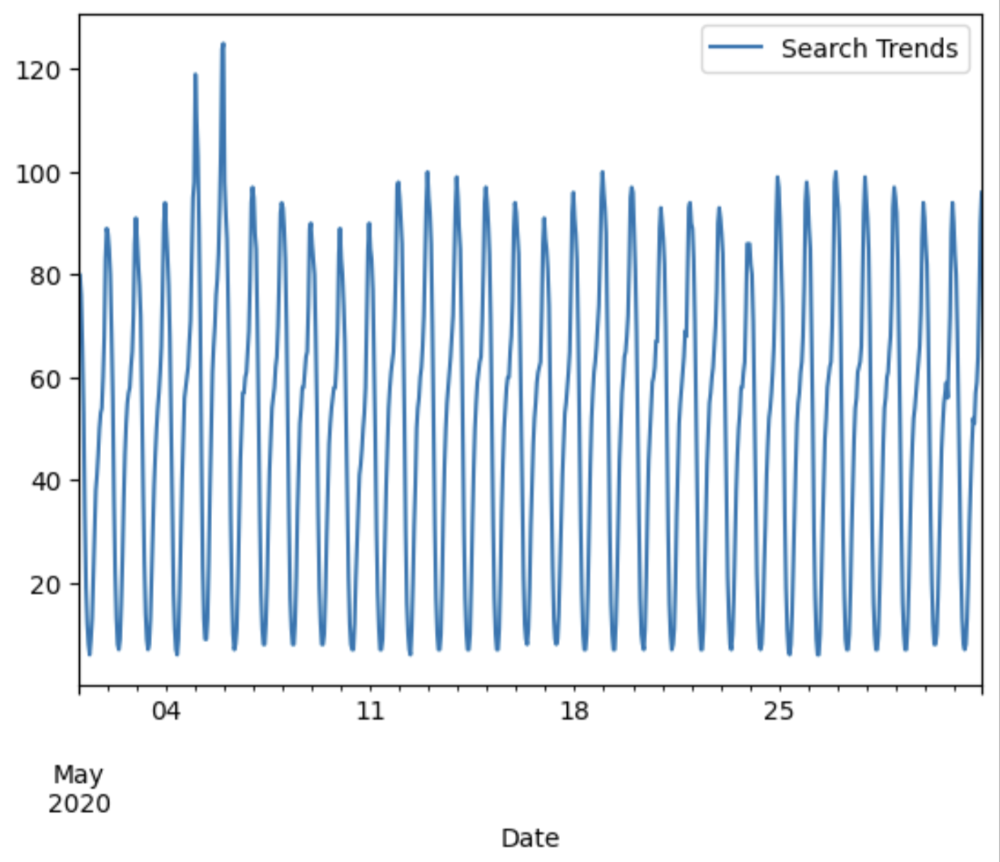

# Mercado 'Search Traffic vs Stock Price' Trend Analysis 

## Project Overview
This project is for the top e-commerce site in Latin America, Mercado Libre. In this program, the goal is to find any unusual trends in the hourly Google search traffic and compare them to the stock price patterns. 
## Installation Instructions
### Google Colab - Github (strongly suggested)
1. Login to Google Colab
2. File --> Upload Notebook --> Github
- Enter Github user: ncmoliver    
- Repository: prophet-challenge    
- Branch: main    
- Upload & Run program
4. Enjoy your analysis & visualizations 
---
### Google Colab - Save Locally
1. Clone repository `git clone https://github.com/ncmoliver/prophet-challenge.git`
2. Login to Google Colab
3. File --> Upload Notebook --> Upload
4. Open repository & Run program
5. Enjoy your analysis & visualizations
---
## Analysis Steps
| Step | Description |
| ----------- | ----------- |
| Step 1 | Title |
| Step 2 | Text |
| Step 3 | Title |
| Step 4 | Text |
## Screenshots
#### Did the Google search traffic increase during the month that MercadoLibre released its financial results?

## References
[Xpert Learning Assistant](https://bootcampspot.instructure.com/courses/6028/external_tools/313)    
[UNC Bootcamp Spot - Activities](https://git.bootcampcontent.com/UNC-Chapel-Hill/UNC-VIRT-AI-PT-06-2024-U-LOLC)    
[Markdown Cheatsheet](https://www.markdownguide.org/cheat-sheet/)

